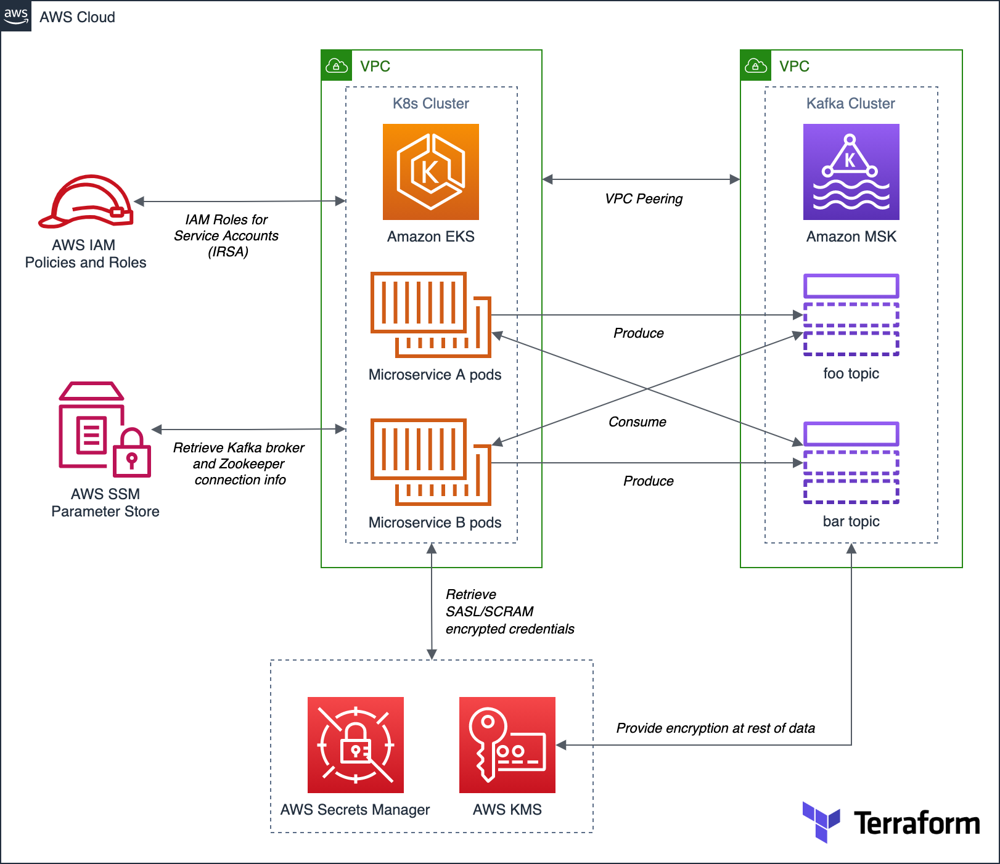

# Amazon MSK, Amazon EKS, SASL/SCRAM Demo

Terraform project from the post: Securely Decoupling Applications on Amazon EKS using Kafka with SASL/SCRAM

Simple Go-based application deployed to Amazon Elastic Kubernetes Service (Amazon EKS). The microservices that comprise the application communicate asynchronously by producing and consuming events from Amazon Managed Streaming for Apache Kafka (Amazon MSK).

## Architecture

---
